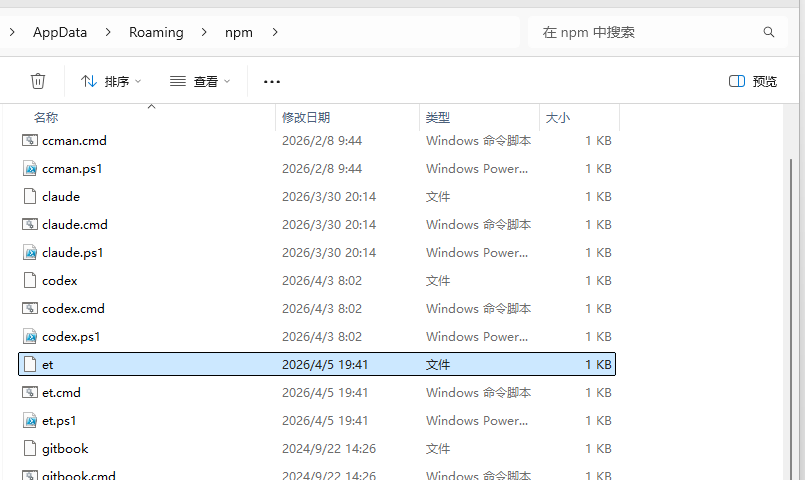
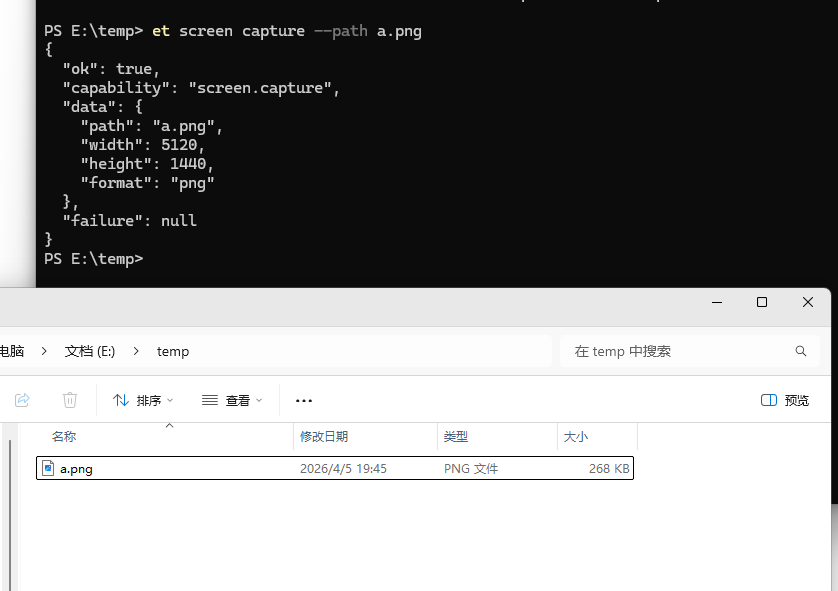
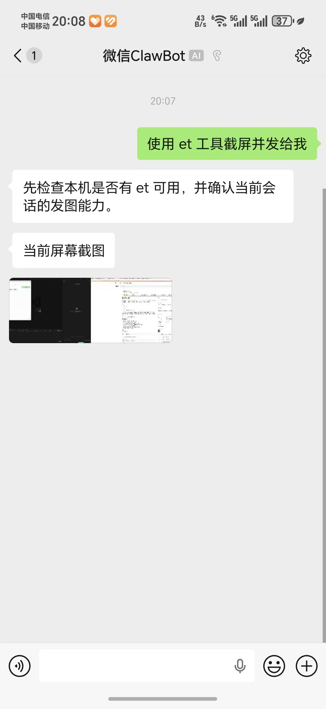

# EasyTouch

## 中文 | [English](README.en.md) 

跨平台系统自动化操作工具，支持 Windows、Linux、macOS。提供 CLI 命令行和 MCP 服务器两种使用方式，支持鼠标键盘控制、屏幕截图、窗口管理、系统信息查询等功能。

目前支持以下操作系统的 x64 和 ARM64 两种 CPU 架构：

- [x] Windows

- [x] Linux
- [x] MACOS（目前缺少设备验证功能）


**你能用它做什么？**

大家平时使用各类 AI 编程工具，写页面是不是经常碰到 AI 写的页面怎么也不满意，写出来跟设计稿差异很大，这是因为 AI 只能通过读写代码来改进代码，它看不到界面，不像人类有感官。

如果你想通过 OpenClaw 接入微信、飞书，让它截图桌面发给你，但是 OpenClaw 像弱智一样搞不好，或者你希望 AI 能够操作你电脑的设备为你工作，那么 EasyTouch 非常适合你。


因为 EasyTouch 是给 AI 装上手和眼睛，它支持以下功能：

- 系统信息：系统、CPU、内存、磁盘、进程
- 屏幕能力：显示器枚举、像素取色、截图
- 窗口控制：枚举、查找、激活、关闭、前台窗口读取
- 输入控制：鼠标移动/点击/滚轮，键盘按键/组合键/输入/粘贴
- 剪贴板：读文本、写文本、读文件列表
- 等待器：等待窗口、焦点、像素、剪贴板、进程状态
- 应用启动：按路径或 URI 启动目标


### 安装

推荐安装带自动平台选择能力的启动包；如果你只想安装当前系统，也可以直接安装对应平台包：

```bash
# 推荐：自动匹配当前平台
npm i -g @whuanle/easytouch

# Windows
npm i -g easytouch-windows

# Linux
npm i -g easytouch-linux

# macOS
npm i -g easytouch-macos
```


`@whuanle/easytouch` 会在当前主机上调用对应的平台包；平台包内部同时包含 x64 和 arm64 二进制，安装后会根据当前 CPU 架构自动选择对应程序文件。

如果是 Windows，安装后在 `AppData/Roaming/npm` 目录会发现名为 `et` 的文件。




### 使用示例

截取屏幕。

```
 et screen capture --path a.png
```








### 作为 Skills 给 AI 使用（推荐）

只需要执行命令安装 skills 即可。

```bash
npx skills add https://github.com/whuanle/EasyTouch
```

> 注：skills 里面不带脚本，需提前安装当前平台包，第一次使用 AI 会自动安装，或者手动安装，例如 `npm i -g easytouch-windows`、`npm i -g easytouch-linux` 或 `npm i -g easytouch-macos`。


### 作为 MCP 工具使用

如果只是给 AI 工具使用，建议使用 skills 即可，配置 MCP 可能会麻烦一些。

在 Claude、Cursor、VS Code、Sidecar 等工具中，配置 MCP 的方式基本一致。通过 npm 安装后，推荐直接调用全局 `et`，这样 Windows、Linux、macOS 都能使用同一套配置。只有在宿主程序无法从 PATH 找到命令时，才退回到完整路径或 `npx`。


在配置文件中添加：


**全局安装后（推荐，三平台统一写法）**

先执行 `npm i -g @whuanle/easytouch`，或者安装对应平台包，然后使用：

```json
{
  "mcpServers": {
    "easytouch": {
      "command": "et",
      "args": ["mcp-stdio"]
    }
  }
}
```

**宿主程序不走 PATH 时**

- Windows：把 `command` 改成 `C:\\Users\\<你自己的用户名>\\AppData\\Roaming\\npm\\et.cmd`
- Linux / macOS：先执行 `npm prefix -g`，然后把 `command` 改成 `<prefix>/bin/et`

**不想全局安装时（备用）**

如果你不想全局安装，也可以临时通过 `npx` 启动。这里同样建议统一使用 `@whuanle/easytouch`，不要再按平台分别写包名。

- Windows：`command` 推荐写 `npx.cmd`
- Linux / macOS：`command` 写 `npx`

```json
{
  "mcpServers": {
    "easytouch": {
      "command": "npx",
      "args": ["-y", "@whuanle/easytouch", "mcp-stdio"]
    }
  }
}
```

> 如果是在 Windows 的 GUI 程序中配置 MCP，`command` 往往应显式写成 `npx.cmd` 或 `et.cmd`，不要只写 `npx`，否则有些宿主不会按 PowerShell 规则解析 `.ps1` / `.cmd`。


### 平台说明

Windows

- 完全支持所有功能
- 部分功能可能需要管理员权限

Linux

- 官方验证环境：Ubuntu Desktop（22.04 / 24.04）
- 其他发行版和桌面环境为 best-effort，建议先用测试脚本验证
- 建议在图形界面环境中使用（优先 X11 会话）
- 有些功能可能需要 sudo 管理员权限

Linux 依赖可手动安装（Ubuntu）：

```bash
# 基础依赖（推荐）
sudo apt install xdotool xclip xsel imagemagick gnome-screenshot

# Wayland 补充依赖（按需）
sudo apt install ydotool wl-clipboard grim
```

安装后可执行脚本测试兼容性：

```bash
node scripts/test-easytouch.js --cli-only --verbose
```

macOS

- 需要授予辅助功能权限（系统设置 → 隐私与安全性 → 辅助功能）
- 截图功能需要屏幕录制权限


## 许可证

MIT License